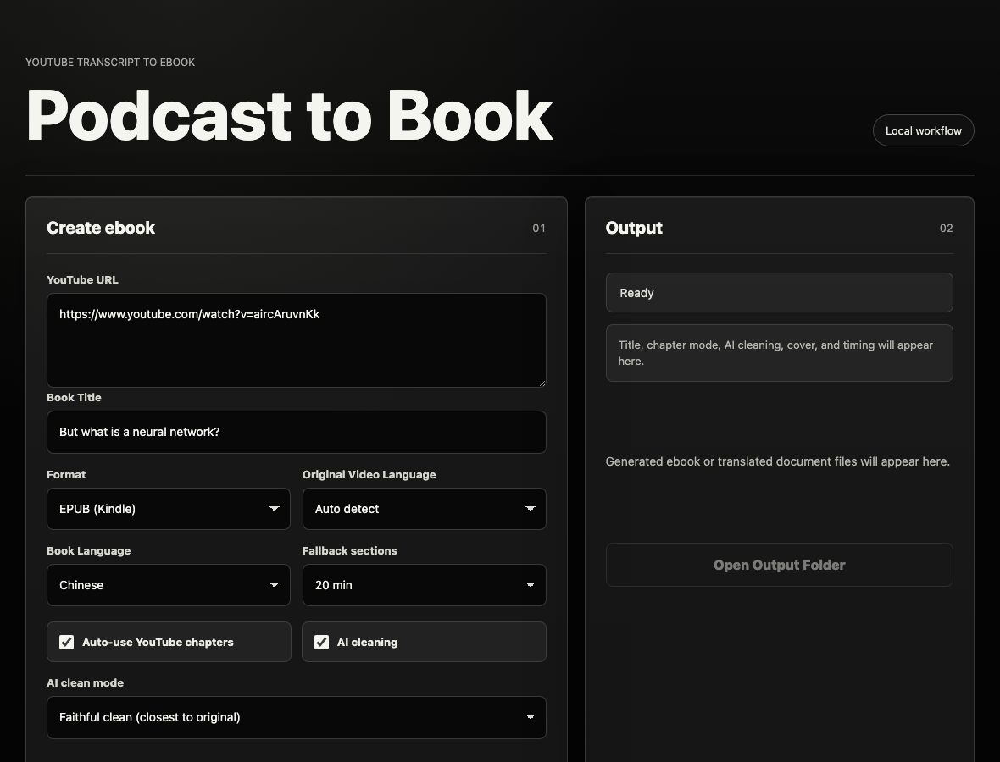

# Podcast to Book

**Turn a YouTube video or podcast into a clean ebook you can actually read —
in English, in Chinese, or both.**



Long videos are hard to study. This turns one into a proper EPUB or PDF: it
pulls the transcript, strips the *ums* and false starts with an LLM, splits it
into chapters, and writes a book.

**It also translates.** Point it at an English podcast and ask for a Chinese
book — the whole thing, chaptered, on your Kindle. That is the part most
transcript tools do not do, and it is why this exists.

```text
YouTube URL  →  transcript  →  AI clean  →  translate  →  chapters  →  EPUB / PDF
```

A second workflow does the same for documents you already have — PDF, EPUB,
DOCX, TXT, Markdown, JSON, CSV, subtitles, HTML — extracting the text, building
a glossary, translating, and packaging the result as a book.

---

## Try it without installing anything

The Python pipeline is a working command-line tool on its own — no Rust, no
build, no API key:

```bash
git clone https://github.com/michaelzhenginchina-rgb/podcast-to-book.git
cd podcast-to-book
./setup.sh
.venv/bin/python runtime/main.py "https://www.youtube.com/watch?v=..." --no-clean
```

That writes an EPUB in the current folder in about ten seconds. `--no-clean`
skips the LLM, so it costs nothing — the transcript keeps its *ums*, but you
can see the whole thing work before deciding to set up a key.

Add a key to `.env` and drop `--no-clean` to get the cleaned version:

```bash
.venv/bin/python runtime/main.py "<url>" --interval 15
```

| Flag | Meaning |
|---|---|
| `--no-clean` | Skip the LLM pass — no key needed |
| `--interval MINUTES` | Minutes of transcript per chapter (default 20) |

The desktop app below adds translation, chapter detection, cover generation
and the document workflow.

## Setup (desktop app)

```bash
git clone https://github.com/michaelzhenginchina-rgb/podcast-to-book.git
cd podcast-to-book
./setup.sh
```

`setup.sh` creates `.venv/`, installs the Python dependencies, and copies
`.env.example` to `.env`. Put your API key in that `.env`, then:

```bash
cargo install tauri-cli     # once
cargo tauri dev             # run it
cargo tauri build           # or build Podcast to Book.app
```

**Requirements:** macOS 10.13+, Rust, Python 3.9+, and an API key from any
OpenAI-compatible provider — see [Choosing an LLM](#choosing-an-llm).

## Choosing an LLM

Not tied to OpenAI. Anything exposing an **OpenAI-compatible chat-completions
endpoint** works — point `LLM_BASE_URL` at it and name the model in `.env`:

| Provider | `LLM_BASE_URL` | Example `LLM_MODEL` |
|---|---|---|
| OpenAI | *(leave unset)* | `gpt-4o-mini` |
| DeepSeek | `https://api.deepseek.com/v1` | `deepseek-chat` |
| Moonshot / Kimi | `https://api.moonshot.cn/v1` | `moonshot-v1-8k` |
| Zhipu / GLM | `https://open.bigmodel.cn/api/paas/v4` | `glm-4-flash` |
| Qwen (DashScope) | `https://dashscope.aliyuncs.com/compatible-mode/v1` | `qwen-plus` |
| Groq | `https://api.groq.com/openai/v1` | `llama-3.3-70b-versatile` |
| OpenRouter | `https://openrouter.ai/api/v1` | `anthropic/claude-sonnet-4.5` |
| Ollama (local) | `http://localhost:11434/v1` | `llama3.1` |

`.env.example` lists these ready to uncomment. With Ollama nothing leaves your
machine and there is no bill — put any placeholder in `LLM_API_KEY`.

Cost reporting only knows OpenAI's published prices; for other providers set
`LLM_PRICE_INPUT` / `LLM_PRICE_OUTPUT` (USD per 1M tokens) or the run simply
reports tokens without inventing a number.

## Configuration

`LLM_API_KEY` is the only thing you need. The app asks for nothing else — no
account, no email, no password. (`OPENAI_API_KEY` still works.)

Everything is resolved relative to the repository, so a clone works wherever you
put it. These overrides exist but are rarely needed:

| Variable | Purpose |
|---|---|
| `PODCAST_TO_BOOK_RUNTIME` | Use a Python runtime outside `runtime/` |
| `PODCAST_TO_BOOK_REPO` | Point a built app at a different checkout |
| `PODCAST_TO_BOOK_PYTHON` | Use a specific interpreter |

## Reading it

The app produces a file and stops there — it deliberately does not touch your
email or your reader account. Move it however you prefer:

- **USB** — plug the Kindle in and drop the EPUB into `documents/`.
- **Send to Kindle** — drag the file onto
  [Amazon's upload page](https://www.amazon.com/sendtokindle).
- **Email** — forward it to your own `@kindle.com` address.
- **Anything else** — it is a plain EPUB or PDF, so Apple Books, Calibre and
  every other reader open it too.

Pick **EPUB** for Kindle and most e-readers; **PDF** keeps fixed layout.

## Output

```text
~/Desktop/PodcastToBook/
  podcast_YYYYMMDD_HHMMSS/               ebook runs
  document_translation_YYYYMMDD_HHMMSS/  translation runs
```

Set `PODCAST_TO_BOOK_OUTPUT` to write somewhere else.

## Layout

| Path | What it is |
|---|---|
| `frontend/` | UI — plain HTML/CSS/JS, no framework |
| `src-tauri/` | Rust shell: resolves paths, spawns Python, collects results |
| `runtime/main.py` | The pipeline — transcript, chapters, EPUB, PDF |
| `runtime/transcript_cleaner.py` | LLM cleanup of raw transcript text |
| `scripts/` | Runners the app invokes, plus shared path resolution |
| `skills/podcast-ebook/` | Agent skill describing this system |

`scripts/` and `runtime/` are bundled into the built `.app` under
`Contents/Resources`, so a packaged build does not depend on the repository
staying where it was built.

## Cost

Transcript cleaning and translation call an LLM, which usually costs money.
A typical hour-long video runs a few cents on `gpt-4o-mini`, less on DeepSeek,
and nothing at all on a local Ollama model. The app reports token usage after
each run.

## Known limits

- macOS only. Builds are ad-hoc signed, so sharing the `.app` itself needs
  proper signing and notarization — clone and build instead.
- No automated tests.
- Scanned PDFs need OCR before the translation workflow can read them.
- Needs a video that actually has a transcript. YouTube auto-captions work;
  videos with captions disabled do not.

## License

MIT — see [LICENSE](LICENSE).
